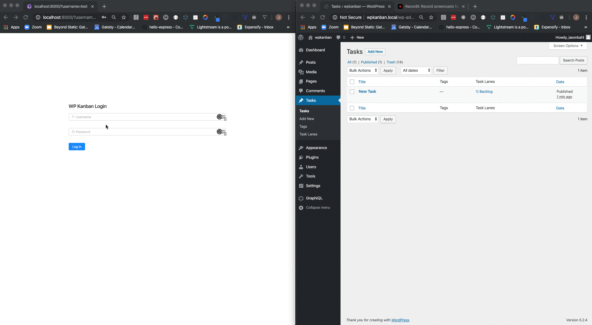

# WPGraphQL + Gatsby Kanban Board

This is a Kanban board created with WPGraphQL and Gatsby, making use of react-trello.

This demonstrates how Gatsby is more than a static site generator, and WordPress can be used to power full applications, beyond simple blogs and marketing sites. 

